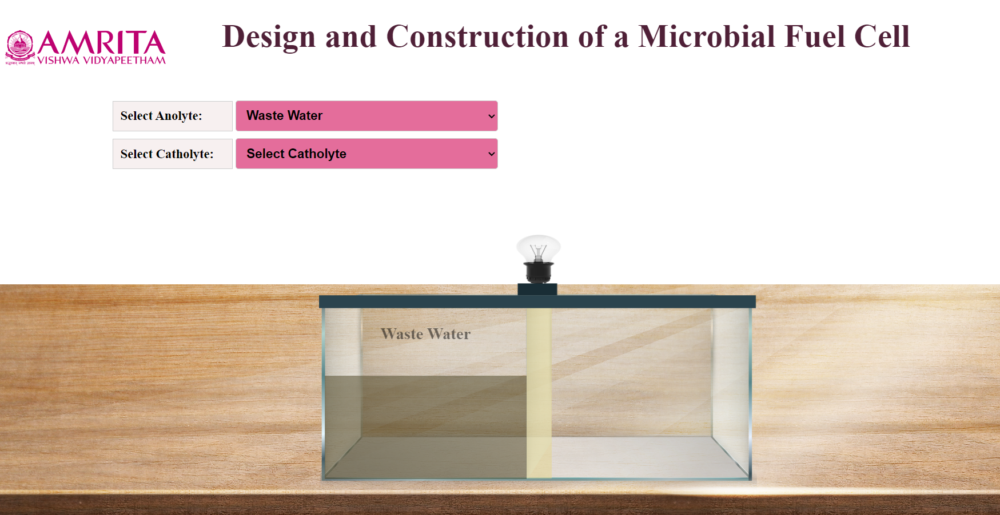
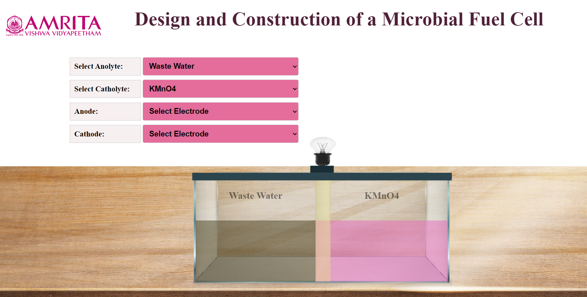
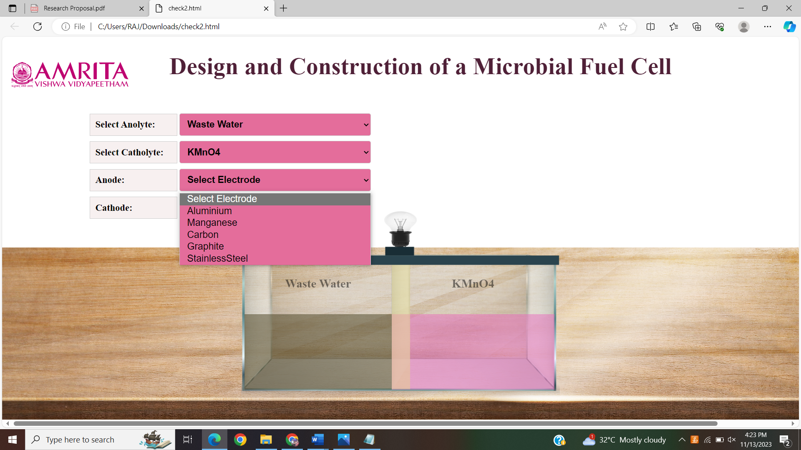
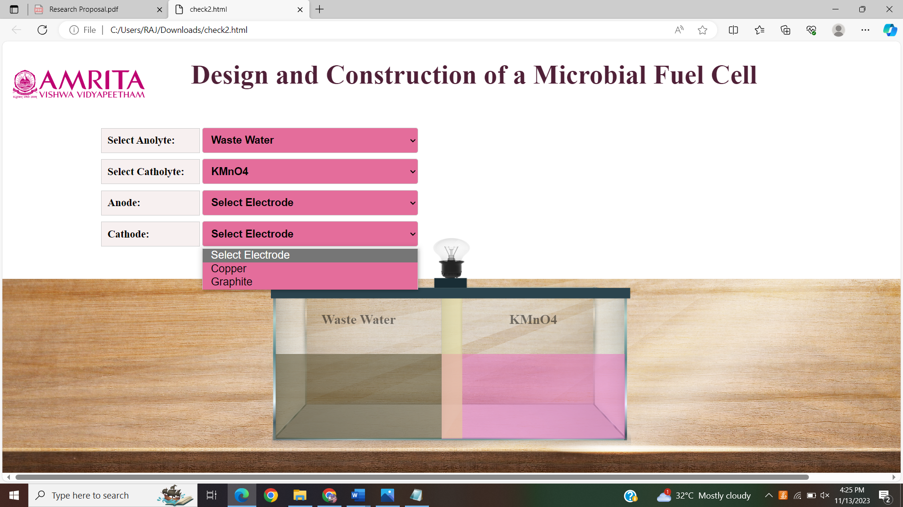
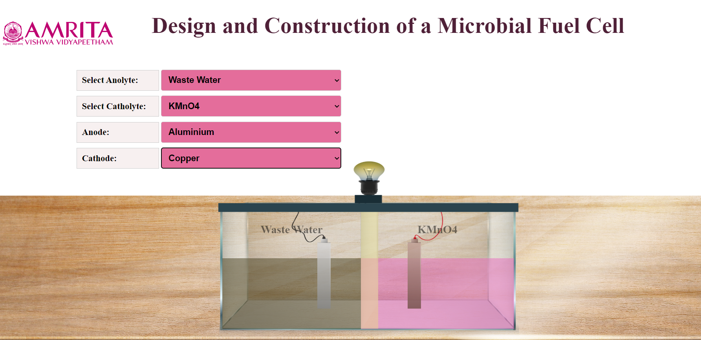

### Procedure

1.	User can open the simulator window. In the simulator window,  input parameters Anolyte and Catholyte were provided. The design of a microbial fuel cell is also displayed. The anodic chamber (anloyte) is filled with waste water. 

&nbsp;

 
2.	Users can choose either KMnO4 or Water as Catholyte.

&nbsp;

 
3.	Here, KMnO4 is chosen as Catholyte. At the same time users can select Anode and Cathode.  

&nbsp;

4.	As anode, Aluminium, Manganeese,Carbon, Graphite, Stainless Steel were provided as  option and Copper, Graphite were provided for option as Cathode.Users can select anode and cathode according to their choice. 

&nbsp;

 

 

5.	Here, Anolyte is Wastewater, Catholyte is KMnO4, Anode is Aluminum and Cathode is Copper. After finishing the connections, the microorganisms in the wastewater (anolyte) consume the substrate and start producing current (milli ampere). As a result, users can see electric bulb glowing in the system.

&nbsp;
 

6.	Users can change parameters and can use different combinations of electrode to learn the functioning of a laboratory scale microbial fuel cell.
