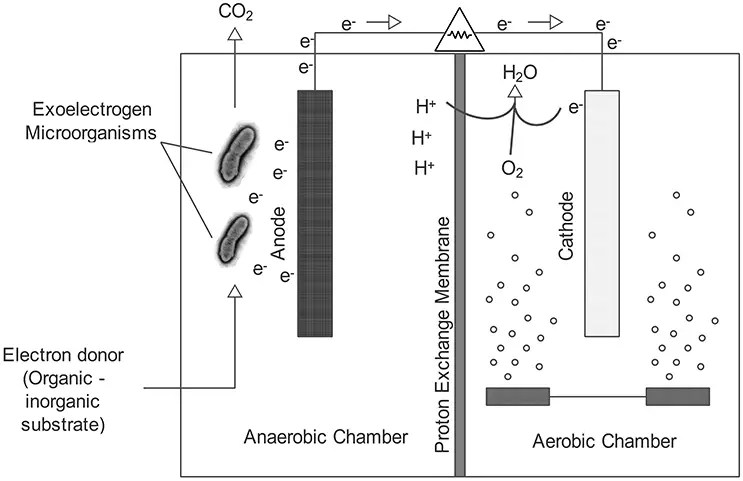
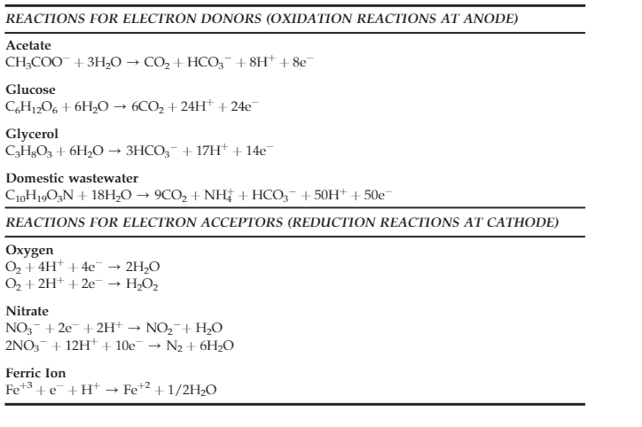

### Introduction

In the 21st century, the increased rate of industrialization and rapid increase in world population has led to the rise of the energy crisis.  In day-to-day life, due to easy access to resources such as coal, gas, oil, and nuclear energy, these become the fundamental resources to produce electricity. The continuous use of such resources may pose environmental problems and pollution leading to global warming and ozone depletion. This demands the need for renewable energy resources such as sunlight, wind, tides and waves, geothermal heat, and biomass conversion as sustainable energy sources for generating electricity with both environmental and economic benefits. Literature indicates that microorganisms are promising for producing a small percentage of energy without damaging the environment or disrupting food resources. This has been reported as a fundamental tool for accelerating microbial bio-energy production thereby replacing it with conventional batteries. Generally, the use of fuel cells, particularly microbial fuel cells, is characterized by other renewable energy sources to generate clean electric energy. 

&nbsp;

### Theory 

A microbial fuel cell (MFC) is a promising renewable and sustainable new technology that converts the chemical energy resident in organic materials into electric energy mediated by microorganisms as biocatalysts for oxidizing the biodegradable substrate. The MFCs have found significant application in the treatment of wastewater that contains bulk amounts of nutrients for contributing to energy production along with degradable contaminants. MFCs revitalize energy from wastewater as a sustainable approach for wastewater treatment improving the water quality and environment. The treated wastewater is circulated back to the environment with nutrient and mineral recoveries that could be applicable for improving the agriculture field by providing minerals from the wastewater resulting in a circular economy. Polycyclic aromatic hydrocarbons (PAHs), which are highly toxic, mutagenic, and carcinogenic in industrial wastewater were treated anaerobically by the MFC technology resulting in a sustainable approach for bioremediation of wastewater. The dual performance efficiency of MFCs in wastewater treatment and electricity production gradually reduces the Chemical Oxygen Demand (COD) level of the wastewater. 
&nbsp;

A typical MFC consists of anodic and cathodic compartments separated by a cation (positively charged ion) specific membrane. The microorganisms in the anodic compartment of MFCs are exoelectrogenic in nature and generate electrons, protons, Carbon dioxide, and other metabolic products by metabolizing organic matter. The electrons are transferred externally to the cathodic chamber with simultaneous production of electricity. The generated protons in the anodic compartment are transported to the cathodic chamber through the proton exchange membrane, and the protons and electrons in the cathodic chamber combine with oxygen to produce water molecules. Shewanella putrefaciens and Geobacter sulfurreducens were first identified as electricigens. Later many other chemo-heterotrophic and photoautotrophic microbes were identified as potential to extracellularly transfer electrons. 

&nbsp;

### Design and Construction of Microbial Fuel Cell 

Designing and construction of a microbial fuel cell (MFC) involves a combination of techniques and principles of biology, electrochemistry, and engineering. MFCs are widely classified into different types depending on the number of chambers used: single-chambered fuel cell, double-chambered fuel cell, and stacked microbial fuel cell. In a single-chamber microbial fuel cell both the anode and cathode compartments are combined into a single chamber, separated by a proton-exchange membrane (PEM) or some other ion-selective membrane. In double chambered fuel cell anode and cathode are constructed as two separate components separated by a proton-exchange membrane (PEM) or an ion-selective membrane separating them. In a stacked microbial fuel cell, multiple MFC units in series or parallel are connected to increase power output. 

&nbsp;

### Operation of a double-chambered MFC

In this experiment, a two-chambered MFC system was designed. 

### Assembly of components of a microbial fuel cell

The two-chambered MFC consists of an anodic chamber and a cathodic chamber which are connected by an external electrical circuit separated internally by a nutrient agar-based PEM. The culture of B.subtilis was used for seeding the nutrient agar. The slit of PEM was sealed with cello-tape. Nafion membrane with dimensions 10cm X 7cm was the other option as PEM. It is attached to the PEM window using silicone in the cathodic chamber. Wastewater collected from any source (for example, sewage water) is taken as an anolyte and added to the anodic chamber (600ml). In the cathodic chamber, either water or 0.3% potassium permanganate solution (catholyte) was added (600ml). The electrodes in each chamber were wired externally to the source meter to measure the electric current. The PEM prevents direct contact between both chambers. The anodic chamber is kept anaerobic to promote oxidation of substrate by the electroactive microorganisms. 

The electrodes can be Carbon cloth (projected surface area of 98 cm2) in both anode and cathode (dimension 14cmX7cm), Graphite (projected surface area of 70 cm2) in both anode and cathode (dimension 10cmX7cm) and Aluminium (projected surface area of 45 cm2) as anode and copper as the cathode projected surface area of 45 cm2 and dimension 9cmX5cm. The conductive materials such as graphite or carbon in the anode help to attach bacteria present in the water source resulting in biofilm formation. The anode and cathode electrodes were connected to an external circuit (Fig.1). 

&nbsp;

### Working Principle of MFCs

The microorganisms, mostly bacteria, naturally present in the wastewater filled in the anodic chamber undergo metabolic processes and release electrons as a byproduct. The electrons flow from the anode electrode to the cathode through the external circuit and this flow constitutes electric current generation. At the cathode, the electron acceptors consume electrons and protons from the anode and reduce water. This redox reaction completes the electron transfer cycle (Fig.2), and the generated electricity can be used for sensors or working any small electronic devices.
 

&nbsp;

Fig. 1. Schematic representation of a two chambered microbial fuel cell(Adapted from https://microbeonline.com/microbial-fuel-cells-mfcs-types-components-and-applications/) 

&nbsp;

Fig.2. Possible oxidation and reduction reactions in a MFC (adapted from Koroglu, E. O., Yoruklu, H. C., Demir, A., & Ozkaya, B. (2019). Scale-up and commercialization issues of the MFCs: challenges and implications. In Microbial electrochemical technology (pp. 565-583). Elsevier.) 

&nbsp;

Power generation at different time duration were recorded for plotting polarization curves. The commonly used substrates in anode chamber include wastewater, acetate, or other organic compounds. The choice of anolyte and catholyte depends on the specific research applications.

The MFCs were widely applied in wastewater treatment, removing metals and nutrients from wastewater, bioremediation, desalination, and in biosensors environmental monitoring, hydrogen production and synthesis of chemicals with economic interest. 
